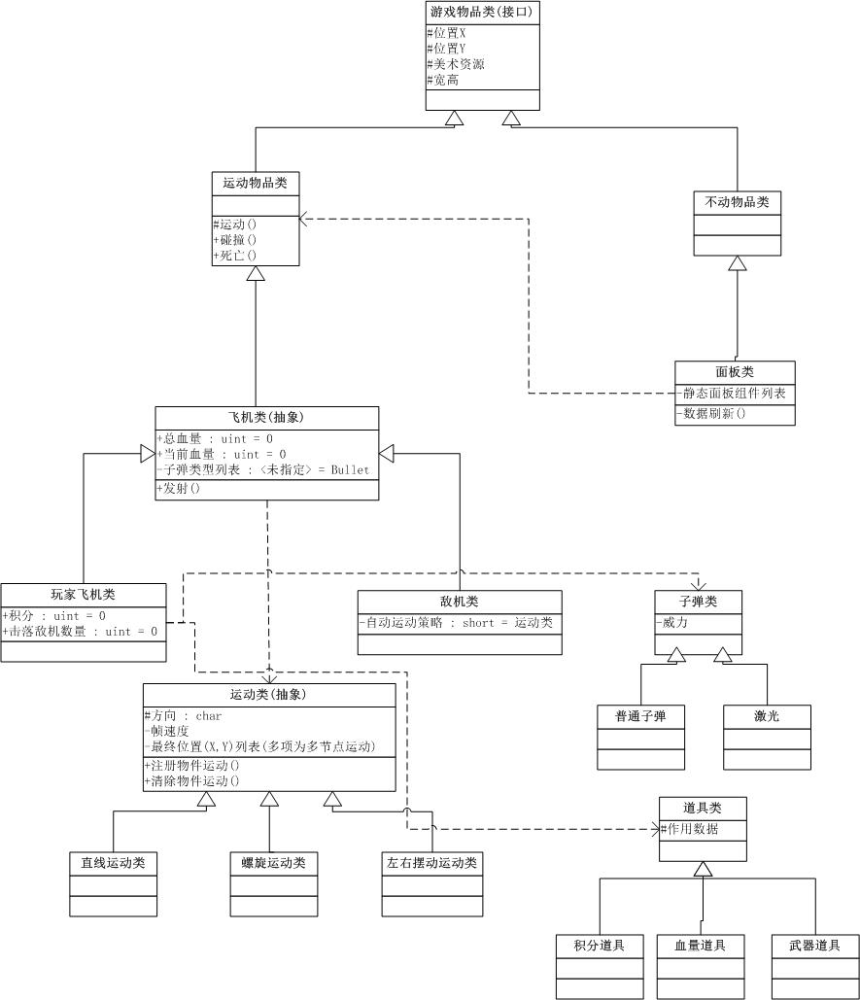
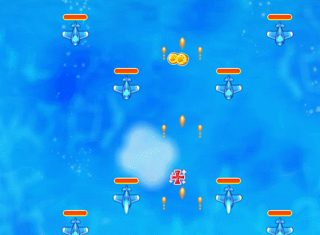
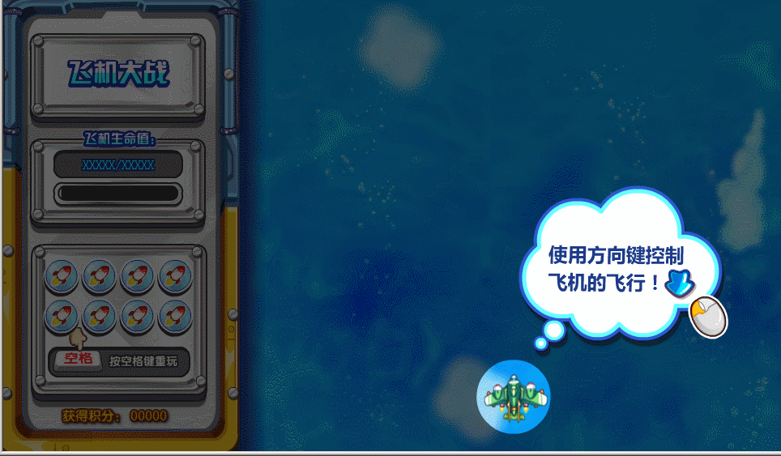

### UML类图

### 1.控制己方飞机移动（鼠标和键盘控制二选一实现），固定间隔时间自动发射子弹。
* 实现方式: 创建键盘控制类，统一监听舞台键盘按下、抬起事件、再分别派发到注册了相关事件的元件上(如我方飞机)
* 文件: `KeyBoradController.as`
* 事件注册
```
// 为传入元件注册按下与抬起事件
public function addKeyUpDown(obj:MovieClip):void {
    keyDownArr.push(obj);
    keyUpArr.push(obj);
}
```
* 事件派发
```
// 舞台监听键盘按下与抬起事件
private function keyTwo() {
    this.stage.addEventListener(KeyboardEvent.KEY_DOWN, KeyDownHandler);
    this.stage.addEventListener(KeyboardEvent.KEY_UP, KeyUpHandler);
}
// 键盘按下事件处理函数，将事件分发到注册了响应事件的元件
private function KeyDownHandler(evt:KeyboardEvent) {
    for (var i:int = 0; i < keyDownArr.length; i++) {
        keyDownArr[i].KeyDownHandler(evt);
    }
}
```
* 事件处理(飞机移动)
```
override public function move(isMyPlane:Boolean = false) {
    nextPosX = this.x;
    nextPosY = this.y;

    if (keyObj[37]) {
        nextPosX -= this.speed;
        this.gotoAndStop(5);
    }
    if (keyObj[38]) {
         nextPosY -= this.speed;
    }
    if (keyObj[39]) {
        this.gotoAndStop(3);
        nextPosX += this.speed;
    }
    if (keyObj[40]) {
        nextPosY += this.speed;
    }
}
```

### 2.自动生成敌方飞机，敌方飞机出现形式有单架，一横排，V型...
* 实现方式: 创建关卡类，将舞台可视区划分为一行7个，写入关卡阵型配置表形如:
`[1, 0, 0, 0, 0, 0, 1,-405]`
1-6 表上对应飞机 -405表上即使本行飞机没有全部被销毁，后面行飞机依然可以继续入场；-404反之。
如果`[-1,0,0,0,0,0,0,-404]`
* 文件: `Level.as` 配置文件 `LevelRow.as`配置解析文件
* 常用阵型配置实例
* 一行
 [1, 1, 1, 1, 1, 1, 1,-405],
* V行
```
 [1, 0, 0, 0, 0, 0, 1,-405],
 [0, 1, 0, 0, 0, 1, 0,-405],
 [0, 0, 1, 0, 1, 0, 0,-405],
 [0, 0, 0, 1, 0, 0, 0,-405],
```
* X行
```
 [1, 0, 0, 0, 0, 0, 1,-405],
 [0, 1, 0, 0, 0, 1, 0,-405],
 [0, 0, 1, 0, 1, 0, 0,-405],
 [0, 0, 0, 1, 0, 0, 0,-405],
 [0, 0, 1, 0, 1, 0, 0,-405],
 [0, 1, 0, 0, 0, 1, 0,-405],
 [1, 0, 0, 0, 0, 0, 1,-405],
```

### 3.敌方子弹有多种运动轨迹，垂直，散射和追踪。
* 实现方式:创建Move类,尽管运动轨迹多种，但细分每个运动周期看都为短距离的线性运动，所以从Move派生出LineMove类
* 文件: `LineMove.as`
* 垂直(1号敌机子弹(EnemyBullet1.as)从上到下移动)

```
public function EnemyBullet1(posX:Number, posY:Number, moveArea:Object=null, speed:Number = 8) {
    super(moveArea, posX, posY, speed);
    this.force = 2;
    //(artRes:MoveGameItem【运动对象】, direction:Array 【0-7】, frameSpeed:Array【移动速度】, moveNode:Array【多节点运动节点配置】)
    this.moveWay = new LineMove(this, [6], [this.speed], [{x: 960, y: GameItem.ScreenHeight + this.height}])
}
```
* 散射(4号敌机散射子弹(EnemyBullet4.as))

```
 public function EnemyBullet4(posX:Number, posY:Number, degree:Number, speed:Number = 8, moveArea:Object = null) {
    super(moveArea, posX, posY, speed);
    this.force = 10;
    this.degree = degree;
    // degree 5 5.5 6 6.5 7
    this.rotation = (6 - degree) * 45;// 旋转度数
    this.moveWay = new LineMove(this, [degree], [this.speed], [{x: degree < 6 ? MoveGameItem.panel.width - 60 : GameItem.ScreenWidth + 50, y: GameItem.ScreenHeight + this.height}]);
}
```
* 追踪(7号敌机跟踪子弹(EnemyBullet7.as))

```
public function EnemyBullet7(posX:Number, posY:Number, isLeft:Boolean, isStraight:Boolean=false, speed:Number = 8, moveArea:Object = null) {
    super(moveArea, posX, posY, speed);
    this.isLeft = isLeft;
    this.force = 80;
    this.rotation = isStraight?6:(isLeft ? 5 : 7) * 45;
    this.moveWay = new LineMove(this, [isStraight?6:(isLeft ? 5 : 7)], [this.speed], [{x: isLeft ? MoveGameItem.panel.width - 60 : GameItem.ScreenWidth + 50,
    y: GameItem.ScreenHeight + this.height}])
}
```

### 4.双方飞机有生命值，被子弹击中减少生命值（只受对方子弹伤害）
* 实现方式:每次帧监听是判断当前子弹 与 其他场内物件 是否发生碰撞。并且对于敌方子弹(派生于EnemyBullet)、我方子弹(派生于MyBullet)、敌方飞机(派生于EnemyPlane)、我方子弹(派生于MyPlane)可以通过类进行判断是否为对方物件
* 文件: `Main.as`
```
// 敌机子弹碰我
if (Level.moveItemList[itemIndex] is EnemyPlane && myPlane.curLife > 0) {
//==========敌机子弹打到我==============================//
	bullet.hit(myPlane);			
} 
```
```
// 我方子弹碰敌机
private function myBulletHitEnemyPlane(bullet:Bullet)
{
	//==========我子弹打到敌机==============================//
	var allEnemyPlane:Array = Level.getAllEnemyPlane();
	if (myPlane.curEffect[3] == 0)
	{
		for (var enemyPlaneIndex:Number = 0; enemyPlaneIndex < allEnemyPlane.length; enemyPlaneIndex++)
		{
			var beHitedEnemyPlane:* = allEnemyPlane[enemyPlaneIndex];
			if (bullet.hit(beHitedEnemyPlane))
			{
				break;
			}
		}
	}
}
```
```
// Bullet.as 碰撞检测
public function hit(target:*):Boolean {
    if (this.hitTestObject(target)) {
        target.bang(this.force * (isHitMiddle(target)?2:1));
        this.isFreeze = true;
        rc(this);
        return true;
    }
    return false;
};
// 被击中减少生命值()
override public function bang(force:Number) {
    this.curLife -= force;// 伤害值
    (((getChildByName("lifeBar") as MovieClip).getChildByName("lifeBar") as MovieClip)).gotoAndStop(Math.round(100 * (totalLife - curLife) / totalLife) + 1);// 更新生命条
}
```
### 5.击溃敌方飞机获得积分（积分计算自定义），击溃敌机播放爆炸动画。
* 实现方式: 敌机爆炸就讲敌机生命直接转换为积分，并且通过setTimeOut爆炸敌机死亡后2s有爆炸动画。
* 文件: `EnemyPlane.as`
```
override public function bang(force:Number) {
    if (this.curLife <= 0) {
        this.gotoAndStop(3);
        panel.updateScore(that.totalLife * MyPlane.isDoubleScore);
        // boss死亡游戏结束
        if(this.curLife<=0 && this is EnemyPlane6){
            Level.gameOver();
            return;
        }
        dieTimeOutId = setTimeout(function() {
            clearTimeout(dieTimeOutId);
            dieTimeOutId = 0;
            that.dieFreeze();
        }, 500)
    } else {
        this.gotoAndStop(2);
        timeOutId = setTimeout(function() {
            clearTimeout(timeOutId);
            timeOutId = 0;
            that.gotoAndStop(1);
        }, 500)
    }
}
```

### 6.实现磁铁、生命药水和双倍积分道具效果。
* 实现方式: 我方飞机维护一个特效数组，和一个对应的特效开关状态管理数组，如果[0,1,1,1] 就表示1-3号特效效果为开，在下一帧内就会渲染对应特效
* 实现文件: MyPlane.as, Effect.as, Prop.as;


### 7.实现导弹效果，导弹使用有冷却时间。
* 实现方式: 首先游戏面板维护一8个导弹组成的导弹数组，如果玩家按空格发射导弹，首先判断是否有可用导弹，如果没有就不能发射导弹，如果有
就对场上所有飞机发送飞机被伤害10点的消息，有飞机.bang函数处理。同时，导弹开始冷却，冷却动画完毕后，导弹可用属性置为`true`,冷却动画停止。
* 实现文件`Panel.as`

```
        private function initMissleArr():void {
        }

        // 是否能发射
        public function canFireMissle():Boolean {

            for (var i:int = 0; i < missleArr.length; i++) {
                if (missleArr[i].isValid) {
                    useMissle = true;
                    coolMissle(missleArr[i])
                 
                    return true;
                }
            }
            return false;
        }
        // 冷却动画
        public function coolMissle(beCooled:MovieClip) {
            beCooled.isValid = false;
            beCooled.gotoAndPlay(1);
          
            beCooled.addFrameScript(beCooled.totalFrames - 1, function() {
                beCooled.isValid = true;
                beCooled.stop();
            });
        }
```

### 8.敌方飞机和双方子弹需要使用对象池存储。
* 实现方式: 敌方飞机又Level类moveItemList管理维护，每个飞机子弹又自己的bulletArr维护
* 实现文件:`Level.as` `Plane.as`
* 对象池重用子弹实现
```
        // 定时发射子弹
        protected function fire(bulletComb:*) {
            var _bulletComb:Array = bulletComb.slice();
            var _bulletCombItem:Object;
            for (var i:int = 0; i < bulletArr.length; i++) {

                if (_bulletComb.length == 0) {
                    break; // 查询完毕
                }
                var typeArr:Array = _bulletComb.map(function(item){
                    return item.type;
                })
                var _bulletCombIndex:int = typeArr.indexOf(bulletArr[i])
                
                if (bulletArr[i].isFreeze && (_bulletCombIndex!=-1)) {
                    _bulletCombItem = _bulletComb.splice(_bulletCombIndex,1)[0];
                    _bulletCombItem.type.born(this.x + _bulletCombItem.x, this.y + _bulletCombItem.y);
                    GameItem.stage.addChild(_bulletCombItem.type);
                }
            }

            for(var j:Number=0; j<_bulletComb.length; j++){
                _bulletCombItem = _bulletComb[j];
                var newBullet:Bullet =  new (_bulletCombItem.type)(this.x +_bulletCombItem.x, this.y + _bulletCombItem.y)
                bulletArr.push(newBullet);
                GameItem.stage.addChild(newBullet);
            }

        }

```

## 进阶（选做）：

### 1.激光道具，拾取发射激光
* 实现方式: 激光只能直线发射 对于Boss与我方的激光 其伤害范围为 x:[飞机左右X间] y:飞机头部y上面这部分区域，直线将在这部分区域的敌机发送bang消息，即可实现激光伤害。
* 实现文件: Main.as

```
	private function useJiGuang()
		{
			// 我的激光清线
			var allEnemyPlane:Array = Level.getAllEnemyPlane();
			if (myPlane.curEffect[3] > 0)
			{
				for (var enemyPlaneIndex:Number = 0; enemyPlaneIndex < allEnemyPlane.length; enemyPlaneIndex++)
				{
					var jiGuangEnemyPlane:* = allEnemyPlane[enemyPlaneIndex];
					if (jiGuangEnemyPlane.y <= myPlane.y && (jiGuangEnemyPlane.x >= myPlane.x && jiGuangEnemyPlane.x <= myPlane.x + myPlane.width))
					{
					
						// 由于激光是持续照射所以每帧伤害很小
						jiGuangEnemyPlane.bang(1);
					}
				}
			}
		}
```
### 2.Boss敌机
* 实现方式: Boss战机特点在于 在关卡剧情的最后 且必须消灭它 游戏就结束。通常其出现流程为先播放一个Boss出厂动画，出来一左一右小飞机，动画期间是不受伤害的。那这样做，先播放动画，一旦播放完毕，马上使用真实的boss飞机与xiaoBoss飞机去替换动画上的位置。
* 实现文件: `LevelRow.as`

```
            if(row[0]==-1){
                // 播放boss动画
                Level.canContinue = false;
                Level.bossEffectComplete = false;
                bossEffect.x = MoveGameItem.panel.width;
                bossEffect.gotoAndPlay(1);
                GameItem.stage.addChild(bossEffect);
                bossEffect.addFrameScript(bossEffect.totalFrames - 1, function() {
                    Level.bossEffectComplete = false;
                    bossEffect.stop();
                    GameItem.rc(bossEffect)
                    
                   
                    Level.bossEffectComplete = true;

                    // 替换real boss 
                    for (var j:int = 0; j < Level.moveItemList.length; j++) {
                        if (Level.moveItemList[j].isFreeze && (Level.moveItemList[j] is EnemyPlane6)) {
                            Level.moveItemList[j].myReBorn(10 + baseX + 250, 110);
                            break;
                        }
                    }

                    var enemyPlane:* = new EnemyPlane6(10 + baseX + 250, 110);
                    Level.moveItemList.push(enemyPlane); // x = 960 屏幕宽度 防止提前碰边界

                    // 替换real 小boss
                    var EnemyPlane7Arr:Array = [];
                    for (var j2:int = 0; j2 < Level.moveItemList.length; j2++) {
                        if(EnemyPlane7Arr.length==2){
                            EnemyPlane7Arr[0].myReBorn(enemyPlane.x - 230, enemyPlane.y + 80);
                            EnemyPlane7Arr[1].myReBorn(enemyPlane.x + 230, enemyPlane.y + 80);
                           
                            return;
                        }
                        if (Level.moveItemList[j2].isFreeze && (Level.moveItemList[j2] is EnemyPlane7)) {
                           EnemyPlane7Arr.push(Level.moveItemList[j2])
                        }
                    }

                    var enemyPlane71:EnemyPlane7 = new EnemyPlane7(enemyPlane.x - 230, enemyPlane.y + 80);
                    Level.moveItemList.push(enemyPlane71); // x = 960 屏幕宽度 防止提前碰边界
                    var enemyPlane72:EnemyPlane7 = new EnemyPlane7(enemyPlane.x + 230, enemyPlane.y + 80);
                    Level.moveItemList.push(enemyPlane72); // x = 960 屏幕宽度 防止提前碰边界
                });
               
                return;
            }
```

### 3.击中敌方中间双倍伤害
* 实现方式: 这个效果在于中间如何判断，你想一个子弹碰一个飞机，只要子弹的x在飞机的左右x间最中间的区域那不就是击中中部吗？当然飞机有大的如boss，小的如1类敌机，我们只需要规定飞机中部±0.25倍飞机宽度为中间即可，至于双倍伤害就是子弹威力*2.
* 实现文件: Bullet.as
```
        // 打中中部位置 双倍伤害
        public function isHitMiddle(target:*):Boolean {
            
           // 敌机头部中间左右 target.width/4 像素为中部
            return (target.x +  target.width/4 >=  this.x) && (target.x -  target.width/4 <=  this.x);
        }
```
### 4.游戏引导教程
* 实现方式: 首先有123 3个引导，只需为每个面板的点击按钮添加点击事件，A点了A被卸载B被显示即可

```
package  {
	import flash.events.MouseEvent;

	public class PlaneGuider extends Guider {	
		public function PlaneGuider(playing:Function) {
			super(0,0);
			this.getChildByName('btnok').addEventListener(MouseEvent.MOUSE_DOWN,function(){
			
				if (GameItem.stage.contains(that)) {
                    GameItem.stage.removeChild(that);
                }
				GameItem.stage.addChild(new MissleGuider(playing));
			})
		}
	}
	
}
```

### 5.死亡重玩
* 实现方式: Boss被打死 或 我方挂了 都触发游戏结束 玩家只需要回车又可以重玩。那么我们使用单例模式构建一个结束面板，当死亡后立即清除场上所有物件，剧情回退到开头，飞机立即初始化。
* GameEndPanel.as

